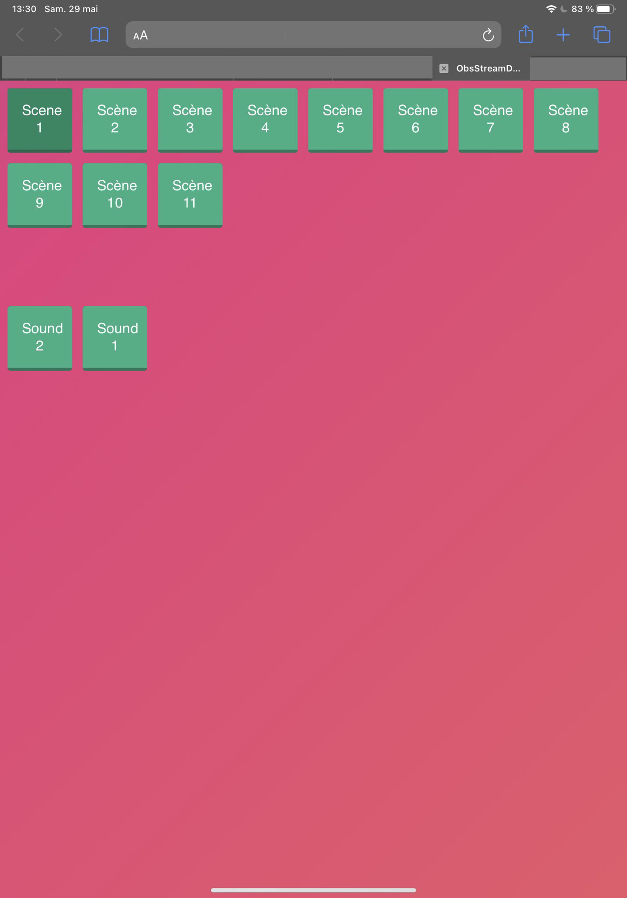
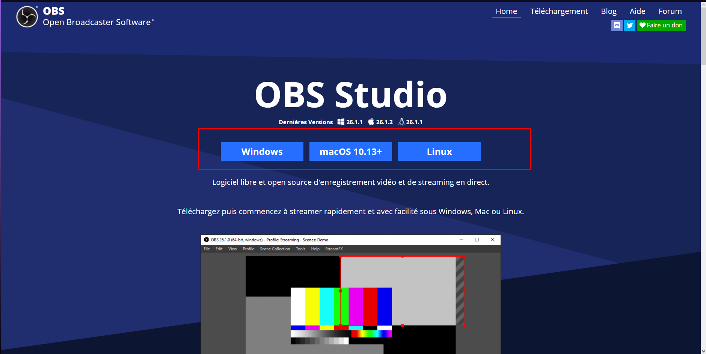
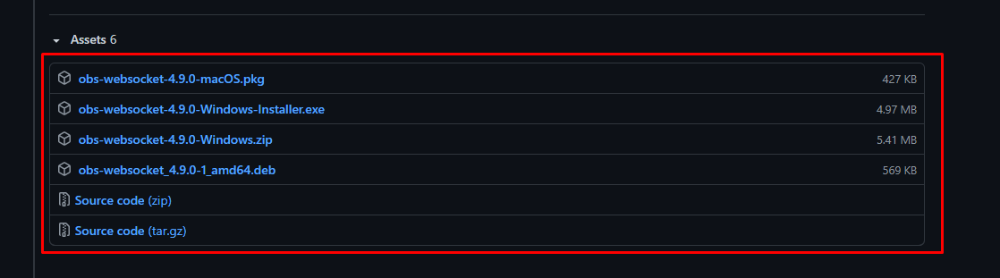
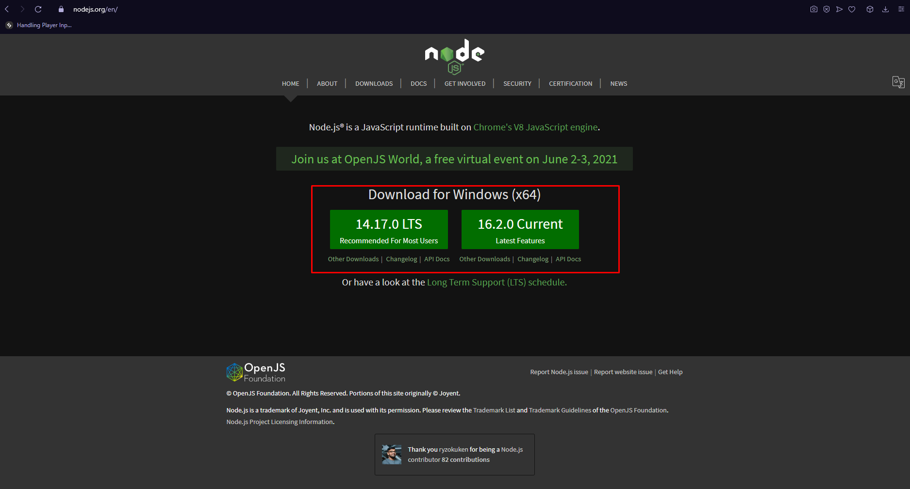
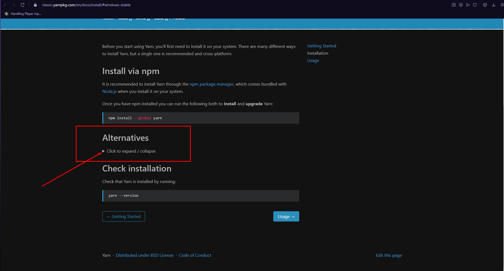
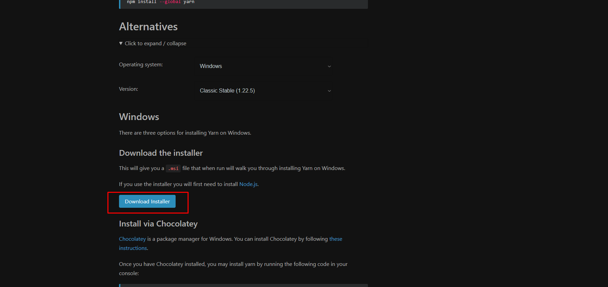
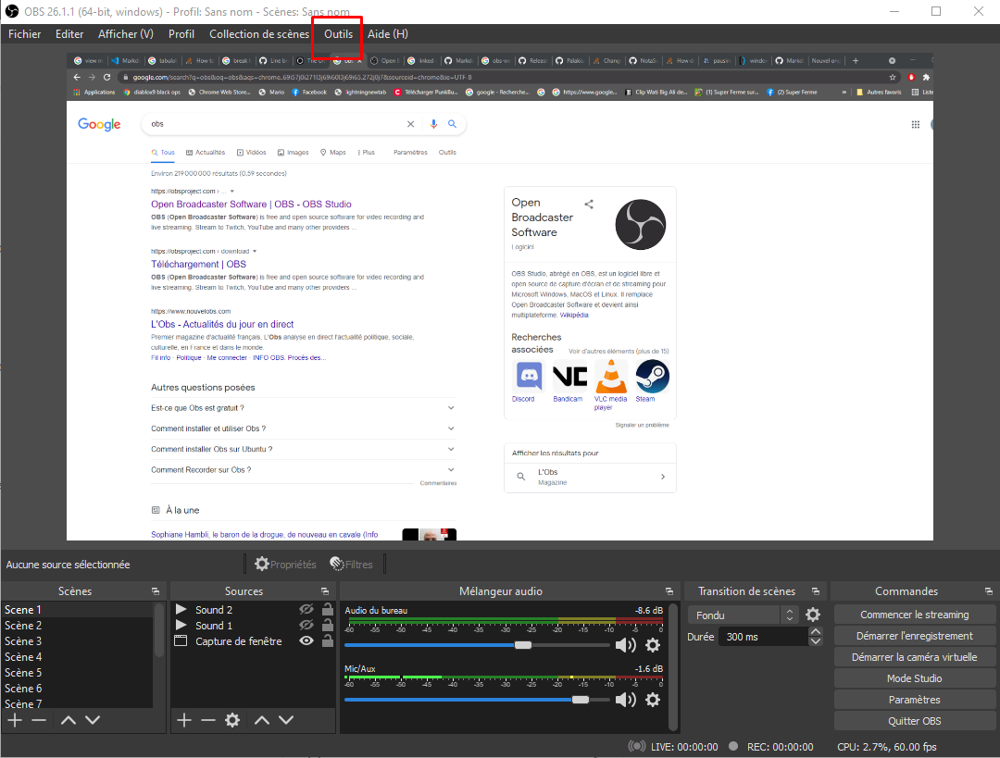
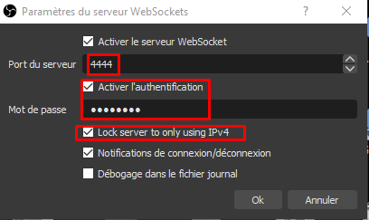

# ObsStreamDeckjs

#### What is ObsStreamDeckjs ?

&nbsp;&nbsp;*__ObsStreamDeckjs is a piece of software that can control obs scene remotly. You can also play the different sounds that you configure in the current scene. Work on Smartphone, Tablet and PC__*     

# What do you need ? (Dependencies)

&nbsp; __First you will need obs.__
[Obs](https://obsproject.com/fr) __<--__       
&nbsp; __Then you will need__ [obs-websocket](https://github.com/Palakis/obs-websocket/releases/tag/4.9.0) __<--__ (__go at the bottom of the page for the installer__)      
&nbsp; __Nodejs / NPM__ __-->__ [Nodejs / NPM](https://nodejs.org/en/)     
&nbsp; __Yarn__ __-->__ [YarnPackageManager](https://classic.yarnpkg.com/en/docs/install/#windows-stable) (__Click "Alternatives" for windows installer__)     

# How to build ?

## obs-websocket server configuration:
&nbsp; First go to obs. Then go to tool/WebSocket server settings       
&nbsp; __Then put this options. In the password section input: `StreamDeckjs`__:     

## Build:
______
&nbsp; First start your Obs.
&nbsp; Then simply run the build.bat by double cliking on it. The server should then start.  
&nbsp; Copy past: ` > Network: http://Your-ip-address:3000/`, and enter it in your browser. 
&nbsp; Then enter the address ip that you just coppied (for example) `192.168.54.544` in the alert box and here we go !! :). 
&nbsp; You should now see your scenes.